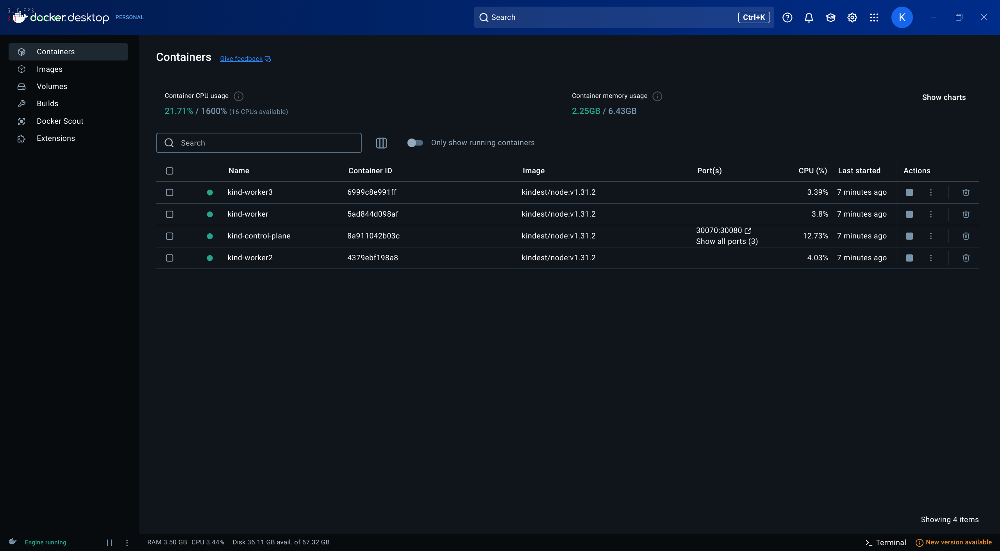
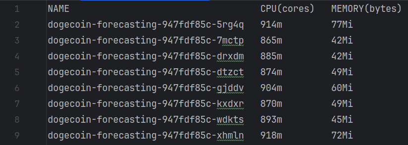
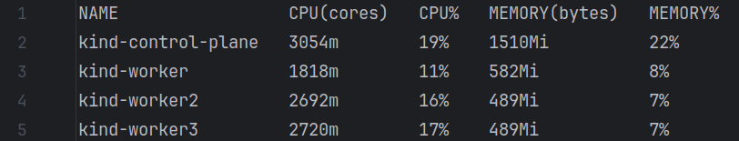

# Cloud-Project


## Disclaimer

The project revolves around a containerized web-app deployed in a Kubernetes cluster.

> This project is intended for educational purposes only.

---

## Prerequisites
Before you begin, you will need to have the following prerequisites:

- A computer running Windows, macOS, or Linux
- Docker Desktop installed on your computer
- A text editor or IDE for writing code and configuration files

We will install a version of Kubernetes called **kind** (Kubernetes in Docker) on Docker Desktop. **kind** is a tool for running local Kubernetes clusters using Docker container nodes. It was primarily designed for testing Kubernetes itself, but it can also be used for local development or CI.
You can find all the information about **kind** [here](https://kind.sigs.k8s.io/).

Before we start, let's first install Docker Desktop on your computer.

## Installing Docker Desktop
### On Linux
Refer to [Install Docker Desktop on Linux](https://docs.docker.com/desktop/install/linux-install/#system-requirements)

Docker Desktop is supported on x86_64 (or amd64) architecture.
For non-Gnome Desktop environments, gnome-terminal must be installed:

    sudo apt-get install gnome-terminal

### On Mac
Refer to [Install Docker Desktop on Mac](https://docs.docker.com/desktop/install/mac-install/)

### On Windows
Refer to [Install Docker Desktop on Windows](https://docs.docker.com/desktop/install/windows-install/)

Docker Desktop requires Microsoft Windows 10 Professional or Enterprise 64-bit.

## Kind installation

Kind is a tool for running local Kubernetes clusters using Docker container nodes. kind was primarily designed for 
testing Kubernetes itself. It can also be used for local development or CI.

You can install and configure **kind** by following the official [quick start](https://kind.sigs.k8s.io/docs/user/quick-start/).

### Install kind
1. On MacOS

        brew install kind

2. On Ubuntu
   - For AMD64 / x86_64
    ```bash
      [ $(uname -m) = x86_64 ] && curl -Lo ./kind https://kind.sigs.k8s.io/dl/v0.25.0/kind-linux-amd64
    ```

   - For ARM64
    ```bash
       [ $(uname -m) = aarch64 ] && curl -Lo ./kind https://kind.sigs.k8s.io/dl/v0.25.0/kind-linux-arm64
    ```

then, execute the following commands:
    
```bash
    chmod +x ./kind
    sudo mv ./kind /usr/local/bin/kind
```

3. On Windows

```powershell
    curl.exe -Lo kind-windows-amd64.exe https://kind.sigs.k8s.io/dl/v0.25.0/kind-windows-amd64
    Move-Item .\kind-windows-amd64.exe c:\some-dir-in-your-PATH\kind.exe
```

# Steps to reproduce the environment
1. Clone the repository

        git clone https://github.com/Kirito-Emo/Cloud-Project.git
2. Change directory to the project folder

        cd Cloud-Project

---

## Cluster creation
- Create a new kind cluster with a name and the configuration file [multinode-config-port-mapping.yaml](multinode-config-port-mapping.yaml) 

         kind create cluster --config=multinode-config-port-mapping.yaml --name=cloud-project
       
- You should get something like this:

        kind create cluster --config=multinode-config-with-port-mapping.yaml
        Creating cluster "kind" ...
         ✓ Ensuring node image (kindest/node:v1.21.1) 🖼
         ✓ Preparing nodes 📦
         ✓ Writing configuration 📜
         ✓ Starting control-plane 🕹️
         ✓ Installing CNI 🔌
         ✓ Installing StorageClass 💾
        Set kubectl context to "kind-kind"
        You can now use your cluster with:
        
        kubectl cluster-info --context kind-kind
        
        Have a nice day! 👋
    
        Not sure what to do next? 😅  Check out https://kind.sigs.k8s.io/docs/user/quick-start/

- Check the number of nodes in this cluster running the command:

         kubectl get nodes
- Check Kubernetes config by running:

         kubectl get nodes -o wide
- Within Docker Desktop, you can see the nodes created by kind by running:
    
         docker ps
- or in the Docker Desktop UI:
     

---

## Metrics Server
Kind does not have a built-in metrics server.

Configuring a Kubernetes deployments to handle specified requirements for applications involves several considerations. It's crucial to ensure that an application is scalable, resilient, and can efficiently manage the expected load. The following are key aspects to consider:

Pods Replicas: start with a reasonable number of replications and make adjustments based on performance testing.
Pods Resources: allocate appropriate CPU and memory resources based on application needs and performance metrics.
In order to achieve metrics about performance of the running application Pods we can use the Metric Server pod: it collects resource metrics from Kubelets and exposes them in Kubernetes apiserver through Metrics API that can also be accessed by kubectl top, making it easier to analyze performance.

Since the Kubernetes Dashboard download a metric server version that doesn’t work due to problem fails to return Node or Pod metrics with certificate, we install a different version of the metric server from [its manifest file](https://github.com/kubernetes-sigs/metrics-server/issues/1025), that includes the argument `--kubelet-insecure-tls` to avoid certificate checks.

To deploy the metrics server, you can use the [metrics-server.yaml](./metrics-server.yaml) file in the repository.

- To apply the metrics server, run:

         kubectl create --filename metrics-server.yaml

---

## Kubernetes Dashboard
To install the Kubernetes Dashboard, launch the following command:

    kubectl apply -f https://raw.githubusercontent.com/kubernetes/dashboard/v2.7.0/aio/deploy/recommended.yaml

This command downloads the deployment manifest and applies it to your cluster.

To access to Dashboard we need to grant the user admin permissions and login to Dashboard using 
a bearer token tied to this user.

> **IMPORTANT**: Make sure that you know what you are doing before proceeding. Granting admin privileges to Dashboard's Service Account might be a security risk.

### Creating a Service Account
To do this step, you need to launch the [dashboard-adminuser.yaml](./dashboard-adminuser.yaml) file through this command:

    kubectl apply -f dashboard-adminuser.yaml

In most cases after provisioning the cluster using kops, kubeadm or any other popular tool, the ClusterRole cluster-admin already exists in the cluster. We can use it and create only a ClusterRoleBinding for our ServiceAccount. If it does not exist then you need to create this role first and grant required privileges manually.
So, now, you need to apply the [cluster_rolebinding.yaml](cluster_rolebinding.yaml) file using this command:

    kubectl apply -f cluster_rolebinding.yaml

### Getting a Bearer Token for ServiceAccount

Now we need to find the token we can use to log in. Execute the following command:
   
    kubectl -n kubernetes-dashboard create token admin-user

It should print something like:
> eyJhbGciOiJSUzI1NiIsImtpZCI6Im9xak55c1FJck1OZXVsMnBxVUxEeUp1QlNBbEhrZXRZeFN4NlZjTl9WUDQifQ.eyJhdWQiOlsiaHR0cHM6Ly9rdWJlcm5ldGVzLmRlZmF1bHQuc3ZjLmNsdXN0ZXIubG9jYWwiXSwiZXhwIjoxNzM4Nzg4MTk1LCJpYXQiOjE3Mzg3ODQ1OTUsImlzcyI6Imh0dHBzOi8va3ViZXJuZXRlcy5kZWZhdWx0LnN2Yy5jbHVzdGVyLmxvY2FsIiwianRpIjoiMDg3OGQ1YTItZmIwMy00OTU5LWIzMDItYWMwMzgyMTEyMTRhIiwia3ViZXJuZXRlcy5pbyI6eyJuYW1lc3BhY2UiOiJrdWJlcm5ldGVzLWRhc2hib2FyZCIsInNlcnZpY2VhY2NvdW50Ijp7Im5hbWUiOiJhZG1pbi11c2VyIiwidWlkIjoiOGE3NDIxMTMtOGJkYS00NGMxLWFkNjItMjM1ZGZhODY0NmZmIn19LCJuYmYiOjE3Mzg3ODQ1OTUsInN1YiI6InN5c3RlbTpzZXJ2aWNlYWNjb3VudDprdWJlcm5ldGVzLWRhc2hib2FyZDphZG1pbi11c2VyIn0.v-YUiE2z2u478wh06YIwdfsIhbnBUfcEhkybJWZoA2iGsV-Yc5fSoCI80oCqoT3P07zRrhzphI56IJ5zTGTPHSS3an1og6sNRl94tDm_KmvLZm8vDizwqfFiPNDMig2r66JkcuMv8Q_frcS-UCFbfAxo__uYM5KC1Ksm-57bPwRK_933qk8mGaEcwMfufin4fxZA806s_ZCxUDK3wK76HXtDFdr6lekDIoE_-TCkzh7fMDFvlEh476WoCoyd-g_UBMmxVFSNmTgGE2623WM2Q5_6blZYO2IOdjUJPFntqFTAAKPJEHgcnPgf7M7oAaWu6UQkZHceLuMDU4l3AZ2SPA

We can also create a token with the secret which bound the service account and the token will be saved in the Secret:

```yaml
    apiVersion: v1
    kind: Secret
    metadata:
      name: admin-user
      namespace: kubernetes-dashboard
      annotations:
        kubernetes.io/service-account.name: "admin-user"   
    type: kubernetes.io/service-account-token  
```

After Secret is created, we can execute the following command to get the token which saved in the Secret:

    kubectl get secret admin-user -n kubernetes-dashboard -o jsonpath={".data.token"} | base64 -d

### Accessing Dashboard

After you start the proxy:

	kubectl proxy

you can access the dashboard at the following link: 

	http://localhost:8001/api/v1/namespaces/kubernetes-dashboard/services/https:kubernetes-dashboard:/proxy/

Now copy the token and paste it into the **Enter token** field on the login screen.
Click the Sign in button and that's it. You are now logged in as an admin.

### Clean up
If you want to remove the admin ServiceAccount and ClusterRoleBinding and Dashboard, then run the following commands:

```bash
    kubectl -n kubernetes-dashboard delete serviceaccount admin-user
    kubectl -n kubernetes-dashboard delete clusterrolebinding admin-user
    kubectl delete -f https://raw.githubusercontent.com/kubernetes/dashboard/v2.7.0/aio/deploy/recommended.yaml
```

To remove the whole kind cluster, you have to run the command:

    kind delete cluster --name=cloud-project

---

## Setting NGINX Ingress Controller
The NGINX Ingress Controller is a popular solution to manage inbound traffic to your Kubernetes cluster. It provides features such as SSL termination, load balancing, and name-based virtual hosting. The NGINX Ingress Controller is deployed as a Kubernetes Deployment and Service.

- To install the NGINX Ingress Controller, run the following command:

        kubectl apply -f https://raw.githubusercontent.com/kubernetes/ingress-nginx/main/deploy/static/provider/kind/deploy.yaml
- To apply the NGINX ConfigMap, stored in [nginx-config.yaml](nginx-config.yaml) file, run:

        kubectl apply -f nginx-config.yaml
---

## Setting PV and PVC
To set up a Persistent Volume (PV) and a Persistent Volume Claim (PVC) in Kubernetes, you need to create a PV and a PVC manifest file. The PV is a piece of storage in the cluster that has been provisioned by an administrator or dynamically provisioned using Storage Classes. The PVC is a request for storage by a user.

Now, to create a PV and a PVC, you can use the [pv.yaml](pv.yaml) and [pvc.yaml](pvc.yaml) files in the repository.

To do that, run the following commands:

```bash
    kubectl apply -f pv.yaml
    kubectl apply -f pvc.yaml
```

---

## Deploy Dogecoin Forecasting App
Before you deploy the Dogecoin Forecasting App, you need to containerize the app using Docker, save it to Docker Hub,
and create a Kubernetes deployment for the app.

```bash
    # Build the Docker image
    docker build --tag dogecoin-forecasting .
    # Run the Docker container
    docker run --publish 8501:8501 -it dogecoin-forecasting
    # To use Docker Scout to analyse vulnerabilities in the Docker image
    docker scout cves dogecoin-forecasting
    # Save the Docker image to Docker Hub
    # Replace <username> with your Docker Hub username
    docker login -u "username" docker.io
    # Push the Docker image to Docker Hub
    docker tag dogecoin-forecasting <username>/dogecoin-forecasting
    docker push docker.io/<username>/dogecoin-forecasting
```

The Dogecoin Forecasting App is a Streamlit App that predicts the closing price of the cryptocurrency based on some inputs entered by the user.

The deployment phase is crucial in ensuring that the application is correctly served within the cloud
environment. This involves containerizing the app, managing it within the Kubernetes cluster, and
exposing it to external traffic.

In the context of Kubernetes the Deployment ensures that the app is correctly containerized and
managed within the cluster, while the Service exposes the app to external traffic. 

We configured the Service to route traffic to **port 80**, leveraging the NGINX Ingress Controller, so the application is accessible from a web browser using
http://localhost:80/.

To deploy the app, you can use the configuration file [k8s_dogecoin_deployment.yaml](k8s_dogecoin_deployment.yaml) present in the repository.
To do so, the command to launch is:

    kubectl create --filename k8s_dogecoin_deployment.yaml

Finally, to expose the app to external traffic, you can use the configuration file [dogecoin-ingress.yaml](dogecoin-ingress.yaml) present in the repository.
To do so, the command to launch is:

    kubectl apply -f dogecoin-ingress.yaml

---

## View the Deployments

	kubectl get deployments

---

## View the Pods

	kubectl get pods

---

## View the Service created

	kubectl get services

---

## View the Ingress

    kubectl get ingress

---

## Troubleshooting
In case of error run

	kubectl describe pod <podname>

and check the errors.

> Change the <podname> with the name of the pod you want to check.

---

## View the Dogecoin Forecasting App on Kubernetes 

	http://localhost:80/

---

### Clean up

You can clean up the resources you created in your cluster by deleting the deployment.

```bash
    kubectl delete services dogecoin-forecasting
    kubectl delete deployment dogecoin-forecasting
```

---

## Simulating traffic to the Dogecoin Forecasting App

To simulate traffic to the Dogecoin Forecasting App, we can use the Apache Benchmarking tool.

In order to test the availability and fault tolerance of the service, you can install and use **wrk**, a modern
HTTP benchmarking tool capable of generating significant load when run on a single multi-core CPU.

To install **wrk** on Linux systems, you can run the following commands:

```bash
    sudo apt-get update
    sudo apt-get install wrk
```

If you are using MacOS, you can install **wrk** using Homebrew:

    brew install wrk

while for Windows, you can use Apache Jemter at https://jmeter.apache.org or **wrk** for Windows available at 
https://github.com/fomalhaut88/winrk.

It allows us to simulate a maximum load of **n** requests at the same time with a simple command:

    wrk -t 8 -c 5000 -d 120s http://127.0.0.1:80/

where:
- **-t p**: sets the number of threads (concurrent connections) to *p*.
- **-c q**: sets the number of connections to *q*.
- **-d ms**: sets the duration of the test to **m** seconds (**m** is followed by s).

This command will simulate 8 threads with 5000 connections each for 120 seconds.

To check the performance of the service, you can use the `kubectl top` command to monitor the resource
usage of the pods in the cluster. This command provides real-time CPU and memory usage metrics for the
pods, allowing you to identify any performance bottlenecks and optimize the resource allocation
accordingly.

    kubectl top pods


    
or 

    kubectl top nodes



### Vertical and Horizontal Scaling

Kubernetes provides built-in support for vertical and horizontal scaling, allowing you to adjust the resource
limits and the number of instances of your application based on the load. Vertical scaling involves
increasing or decreasing the CPU and memory limits of the pods, while horizontal scaling involves adding
or removing instances of the pods.

To scale the Dogecoin Forecasting App horizontally, you can use the **kubectl scale** command to adjust the
number of replicas in the deployment. For example, to scale the deployment to 3 replicas, you can run:

    kubectl scale deployment dogecoin-forecasting --replicas=4

This command will add one more instance of the Dogecoin Forecasting App to the cluster, increasing the
capacity and fault tolerance of the service.
If you want to scale the deployment back to 3 replicas, you can run:

    kubectl scale deployment dogecoin-forecasting --replicas=3

Moreover, you can use the **kubectl autoscale** command to automatically adjust the number of replicas
based on the CPU and memory usage of the pods. For example, to autoscale the deployment based on the
CPU usage to a minimum of 3 replicas and a maximum of 8 replicas, you can run:

    kubectl autoscale deployment dogecoin-forecasting --cpu-percent=80 --min=3 --max=8

To scale the Dogecoin Forecasting App vertically, you can update the resource limits in the deployment
configuration file and apply the changes to the cluster. For example, to increase the CPU limit to 1 CPU
and the memory limit to 750Mi, you can update the deployment configuration file as follows:

```yaml
    resources:
      requests:
        memory: "512Mi"
        cpu: "500m"
      limits:
        memory: "750Mi"
        cpu: "1"
```

Then, you can apply the changes to the cluster by running:

    kubectl apply --filename k8s_dogecoin_deployment.yaml

This command will update the resource limits of the Dogecoin Forecasting App in the cluster, allowing it to
handle more traffic and improve performance.

---

# Files

- **notebook/dogecoin-forecasting-rf-pipeline.ipynb** : Jupyter Notebook with all the workings including pre-processing, modelling and inference.
- **app.py** : Streamlit Dogecoin Forecasting App script
- **requirements.txt** : pre-requisites libraries for the project
- **models/** : trained model files and transformer
- **data/** : source data (the .csv file)
- **k8s_dogecoin_deployment.yaml** : Kubernetes deployment file for the Dogecoin Forecasting App
- **dashboard-adminuser.yaml** : Kubernetes Dashboard configuration file
- **metrics-server.yaml** : Metrics Server configuration file
- **image/** : images for the documentation
- **logs/** : logs for the documentation
- **Dockerfile** : Dockerfile for the Dogecoin Forecasting App
- **cluster_rolebinding.yaml** : Cluster Role Binding for the Kubernetes Dashboard
- **dashboard-adminuser.yaml** : Service Account for the Kubernetes Dashboard
- **dogecoin-ingress.yaml** : Ingress configuration file for the Dogecoin Forecasting App
- **nginx-config.yaml** : NGINX ConfigMap configuration file
- **nginx-custom-rules.yaml** : NGINX Custom Rules configuration file
- **nginx-ingress-deployment.yaml** : NGINX Ingress Controller deployment file
- **pv.yaml** : Persistent Volume configuration file
- **pvc.yaml** : Persistent Volume Claim configuration file
- **stress-test-scaling-script.sh** : Bash script for stress testing and scaling
- **stress_test_results[...]** : Results of the different stress tests

---

## Main devs:
- [Kirito-Emo](https://github.com/Kirito-Emo)
- [quagliofranci](https://github.com/quagliofranci)